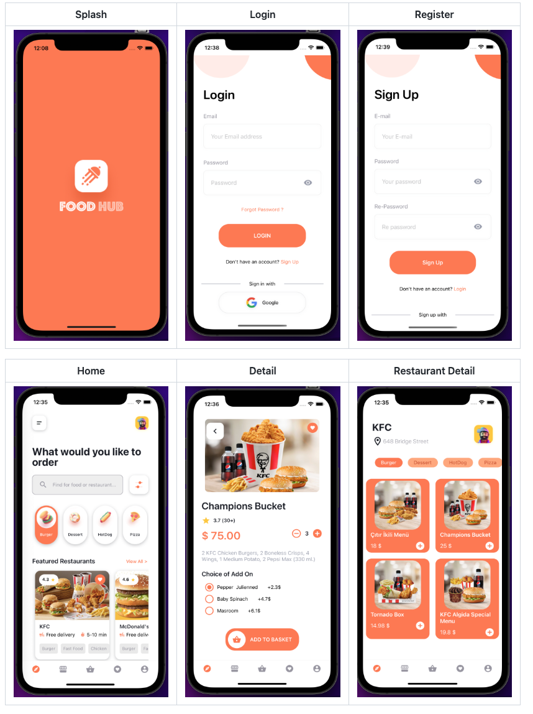

# foodHubApp-ReactNative

    FoodHub application with React Native

# Project Features

1.  React Navigation
2.  Apisauce
3.  React Native Async Storage
4.  React Native Firebase , Authentication
5.  React Native Config
6.  Formik , Yup
7.  React Native Svg
8.  React Native Maps
9.  Redux Toolkit, React Redux, Redux Persist
10. Lottie React Native
11. React Native Vector Icons
12. React Native Flash Message

# Screens

